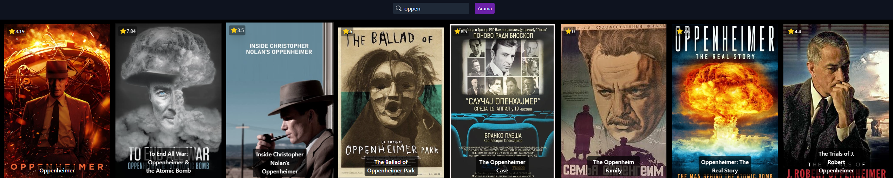
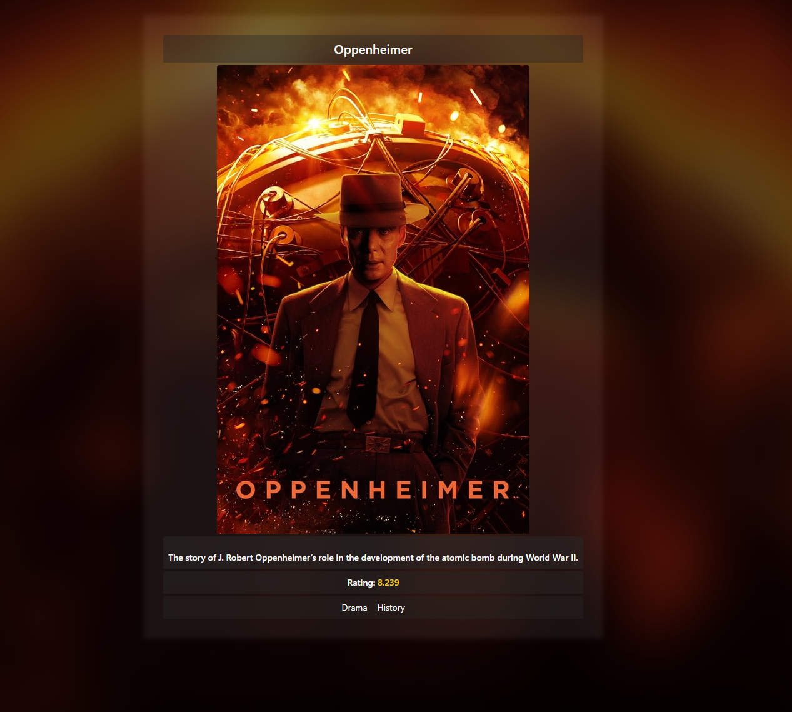

Bu GitHub deposunun ana hedefi, React uygulamalarında yaygın olarak kullanılan useState ve useEffect gibi temel React hooklarını kullanmakla sınırlı.

Bu Next.js uygulaması, The Movie Database (TMDB) API'sini kullanarak film verilerini çeken ve kullanıcılara sunan basit bir web uygulamasıdır. Proje, React tabanlı Next.js çerçevesi ile oluşturulmuştur.

Film Listesi: Uygulama, TMDB API'sini kullanarak popüler filmlerin bir listesini alır ve kullanıcılara gösterir. Bu film listesi, filmin adı, afişi ve kısa bir açıklamasını içerir.

Dinamik Sayfa Yönlendirmesi: Kullanıcılar herhangi bir filme tıkladığında, dinamik olarak oluşturulan sayfalar aracılığıyla film detaylarına yönlendirilirler.

Arama: Kullanıcılar arama çubuğunu kullanarak belirli bir filmi arayabilirler. Arama sonuçları, kullanıcının girdiği anahtar kelimelerle eşleşen filmleri gösterir.
## Screenshots

### Home

### Show Single Movie

